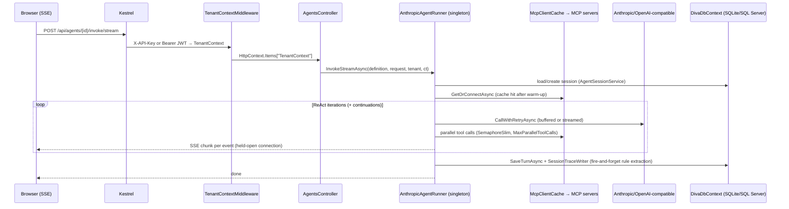

# Backend Agent API — Scalability & Load-Handling Review

> **Date:** 2026-08-11
> **Scope:** Can the agent execution path (`AnthropicAgentRunner` ReAct loop, MCP tool calls, session
> persistence, SSE streaming) handle concurrent agentic requests from hundreds of users?
> **Method:** Static review of the request path end-to-end (Kestrel → middleware → controller →
> runner → MCP/LLM → DB), cross-checked against `docs/perf-improvements.md` and
> `docs/hardening-backlog.md`. Two bugs found during this review were fixed directly (see
> [Fixed during this review](#fixed-during-this-review)); the rest are recommendations.
> **Companion tool:** [`tools/LoadTest`](../tools/LoadTest/README.md) — load generator built to validate
> the findings below against a real deployment.

---

## Verdict

The agent execution engine itself (`AnthropicAgentRunner`) is **well-engineered for per-request
efficiency** — MCP client caching, parallel tool execution, single-pass tool listing, fire-and-forget
rule extraction, `IHttpClientFactory` usage, and configurable timeouts are all already in place (see
[perf-improvements.md](perf-improvements.md)). No singleton service was found holding a captive scoped
`DbContext` (the most common .NET scaling bug) — `IDatabaseProviderFactory.CreateDbContext()` always
constructs a fresh, short-lived context.

However, the system as deployed **has no admission control / backpressure** on the two endpoints that
matter most (`POST /api/agents/{id}/invoke` and `.../invoke/stream`), defaults to **SQLite** (a
single-writer datastore) for session/business-rule/trace persistence, and ships as a **single container
with no replica or resource-limit configuration**. None of this will fail at low concurrency (tens of
users) — the risk is specifically at "hundreds of concurrent users," which is exactly the scenario
being asked about. Treat the P0 items below as required before that rollout, and use the load test
tool to get real numbers for your environment/model/API tier rather than relying on estimates.

---

## Request path recap (for context)

Key fact for capacity planning: **one concurrent chat user = one long-lived SSE connection + one
in-flight LLM call (more during tool bursts) + up to `MaxParallelToolCalls` (default 10) concurrent
tool calls + several DB round-trips**, for the entire duration of the run (which can be minutes with
continuation windows). There is currently no cap on how many of these can run at the same time.

---

## Fixed during this review

These were concrete bugs, not just recommendations — low-risk, self-contained, so they were fixed
directly rather than only flagged.

### 1. MCP client cache stampede (race condition)
**File:** [`src/Diva.Infrastructure/LiteLLM/McpClientCache.cs`](../src/Diva.Infrastructure/LiteLLM/McpClientCache.cs)

`GetOrConnectAsync` did a plain check-then-act on a `ConcurrentDictionary` (`TryGetValue` → if miss,
connect). On a cold cache (first request after startup, after a 30-minute TTL expiry, or right after an
admin edits an agent's tool bindings), **every concurrent request for that agent** would independently
see the miss and race to call `connectFactory` — each spawning its own docker/stdio child process or
HTTP handshake simultaneously, instead of one request populating the cache for the rest. At "hundreds
of users," a burst of sessions starting against the same popular agent right after a deploy would
multiply MCP connection/process overhead by the burst size.

**Fix:** added a per-cache-key `SemaphoreSlim` gate (`ConcurrentDictionary<string, SemaphoreSlim>`) with
double-checked locking — the first caller for a given key connects; concurrent callers wait and then
reuse the now-populated cache entry. Applied to both `GetOrConnectAsync` and `EvictAndReconnectAsync`.

### 2. No jitter in LLM retry backoff
**File:** [`src/Diva.Infrastructure/LiteLLM/AnthropicAgentRunner.cs`](../src/Diva.Infrastructure/LiteLLM/AnthropicAgentRunner.cs) (`CallWithRetryAsync`)

Backoff was deterministic: `BaseDelayMs * 2^attempt` → every failing caller retries at exactly 2s, 4s,
8s. When many concurrent requests hit the provider's rate limit together (very likely at "hundreds of
users" sharing one API key/tier), they retry **in lockstep**, re-creating the same spike against the
provider on each retry round instead of spreading load out.

**Fix:** switched to equal jitter (`half fixed + half random`) so concurrent retries spread out instead
of re-synchronizing.

Both changes build cleanly (`dotnet build Diva.slnx` → 0 errors) and are behavior-preserving on the
happy path (single caller, warm cache) — they only change what happens under concurrent contention.

---

## Findings requiring a decision (not auto-changed)

These affect either request-handling behavior or deployment topology, so they're presented as
recommendations rather than silently changed.

### P0 — before rolling out to hundreds of users

| # | Finding | Why it matters | Recommendation |
|---|---------|-----------------|-----------------|
| 1 | **No rate limiting or concurrency cap on `/api/agents/{id}/invoke` and `.../invoke/stream`** — the primary chat surface. Only the A2A task endpoints (`RateLimitPerMinute`, `MaxConcurrentTasks`) and `scheduler-feedback` have limiters (`Program.cs`, `AddRateLimiter`). | Any number of users (or a single misbehaving client/script) can open unbounded concurrent SSE streams and LLM calls. There's no queueing or 429 backpressure — the system will simply degrade (latency climbs, then provider rate-limit errors, then timeouts) rather than shedding load gracefully. | Add a rate-limiter policy on these two endpoints mirroring the existing `a2a` policy (`RateLimitPartition.GetSlidingWindowLimiter`, partitioned per tenant or per user), plus a global `SemaphoreSlim`/queue in `AnthropicAgentRunner` capping concurrent ReAct loops to a number your LLM tier can sustain. Reject with 429 + `Retry-After` past the cap rather than letting requests queue silently on the thread pool. |
| 2 | **SQLite is the default datastore**, with no `PRAGMA journal_mode=WAL` / `busy_timeout` configured anywhere in code (confirmed — no such PRAGMA exists in `DivaDbContext`/`DatabaseProviderFactory`/`Program.cs`). SQLite serializes writers; every chat turn does ≥3 writes (`SaveTurnAsync` inserts 2 messages + updates `LastActivityAt`) plus full-fidelity `SessionTraceWriter` writes plus background rule-learning writes. | Concurrent write bursts (many users finishing a turn around the same time) will start surfacing `SQLITE_BUSY: database is locked` under sustained hundreds-of-users load — the failure mode is silent until it happens, then intermittent. This is explicitly why the codebase already ships an opt-in SQL Server path ([decisions.md](decisions.md): "SQLite default (dev), opt-in SQL Server (RLS) for prod"). | For a hundreds-of-users rollout, run `docker-compose.enterprise.yml` (SQL Server) rather than the SQLite default. If SQLite must be kept short-term, at minimum enable WAL + a busy_timeout PRAGMA on every connection open (quick mitigation, not a substitute for SQL Server at this scale). |
| 3 | ~~MCP client cache stampede~~ | | **Fixed** — see above. |

### P1 — should do soon after

| # | Finding | Why it matters | Recommendation |
|---|---------|-----------------|-----------------|
| 4 | ~~No jitter in retry backoff~~ | | **Fixed** — see above. |
| 5 | **No global outbound concurrency cap toward the LLM provider.** `AgentOptions.MaxParallelToolCalls` (default 10) only bounds tool calls *within a single request*. Nothing bounds the total number of simultaneous LLM calls across all concurrent users. | Anthropic/OpenAI enforce account-level RPM/TPM limits. At hundreds of concurrent users you will hit provider 429s routinely; the existing retry logic (now with jitter) will help but can't create capacity that doesn't exist. | Consider routing through LiteLLM (already supported via `LLM:UseLiteLLM`) with its own rate-limit/queueing, or add an app-level token-bucket/semaphore sized to your provider tier's RPM. |
| 6 | **A2A task tracking is in-memory only** (`ConcurrentDictionary` in `AgentTaskController`, already flagged in [hardening-backlog.md](hardening-backlog.md)). | In-flight A2A task state is lost on restart and isn't shared across replicas. Not on the main chat path, but relevant once you scale beyond one instance. | DB-backed task tracking (the `AgentTaskEntity` table already exists) — swap the in-memory dictionary for a query against it. |

### P2 — plan for, not urgent at current scale

| # | Finding | Why it matters | Recommendation |
|---|---------|-----------------|-----------------|
| 7 | **Single-container deployment, no replicas, no CPU/memory limits.** Neither `docker-compose.yml` nor `docker-compose.enterprise.yml` sets `deploy.replicas` or `deploy.resources.limits`. In-process singletons (`McpClientCache`, `IMemoryCache`-backed caches, credential-resolution cache) are per-instance — correct, but each replica pays its own MCP cold-connect cost and doesn't share cache state (not a bug, just a capacity-planning fact). | A single container has a hard ceiling (CPU/memory/thread pool) regardless of how well the code scales internally. | Plan for horizontal scale-out behind a load balancer once on SQL Server (session/business-rule state is already DB-backed, so this is mostly ready); set explicit CPU/memory requests+limits so a single tenant's burst can't starve the host. |
| 8 | **No Kestrel limit tuning** — defaults apply (effectively unbounded concurrent connections). Combined with #1, a large number of long-lived SSE connections (each held open for the full run, potentially minutes with continuations) will consume threads/memory proportionally with no ceiling. | Not wrong by itself, but removes the last safety net if #1 isn't done. | Set `Kestrel:Limits:MaxConcurrentConnections` / `MaxConcurrentUpgradedConnections` to a sane ceiling once you know your target concurrency from load testing. |
| 9 | **Minor:** `SchedulerHostedService.cs:822` uses `.GetAwaiter().GetResult()` (blocking call). Low risk — background service, infrequent (feedback-settings lookup), not on the request-serving path — but worth cleaning up opportunistically. | Blocking calls tie up a thread-pool thread; harmless at current frequency but a pattern worth not repeating elsewhere. | Convert the enclosing method to `async` when next touched. |

---

## What was checked and found solid (no action needed)

- **No captive-dependency bug**: every Singleton service (`AnthropicAgentRunner`, `AgentSessionService`,
  `DynamicAgentRegistry`, etc.) accesses the database exclusively via `IDatabaseProviderFactory
  .CreateDbContext(tenant)`, which always `new`s a fresh `DbContextOptionsBuilder` + `DivaDbContext` —
  never resolves a Scoped context from the root container. Confirmed across all 28 call sites.
- **`.Result` usage in `TenantAwarePromptBuilder`** (6 occurrences) is always *after* `await
  Task.WhenAll(...)` on the same tasks — non-blocking, correct pattern, not a sync-over-async bug.
- **Per-tool, per-sub-agent, and per-LLM-call timeouts** all exist and are configurable
  (`ToolTimeoutSeconds`, `SubAgentTimeoutSeconds`, `LlmTimeoutSeconds`, `LlmStreamIdleTimeoutSeconds`).
- **Parallel tool execution** already bounded by a per-request `SemaphoreSlim(MaxParallelToolCalls)` and
  already deduplicates identical concurrent calls (`ReActToolHelper.DeduplicateCalls`).
- **`IHttpClientFactory`** used correctly for both the Anthropic provider and `A2AAgentClient` (with
  `AddStandardResilienceHandler()`) — no socket-exhaustion risk from ad-hoc `new HttpClient()`.
- **No sync-over-async** (`.Result`/`.Wait()`/`.GetAwaiter().GetResult()`) found on any request-serving
  path — the one instance found (`SchedulerHostedService`) is a background service, not per-request.
- **A2A endpoints already have both a rate limiter and a concurrency cap** — the pattern exists in the
  codebase, it just isn't applied to the main chat endpoints yet (see P0 #1).

---

## Suggested rollout sequence

1. Fix P0 items (rate limit + concurrency cap on chat endpoints; move to SQL Server for the target
   deployment).
2. Run the load test tool (below) against a staging environment sized like production, starting at low
   concurrency and stepping up, to find the actual breaking point for your model/API tier/hardware —
   don't guess a number, measure it.
3. Set Kestrel/rate-limiter ceilings just above the measured sustainable concurrency, so the system
   degrades by rejecting new requests with 429 rather than falling over.
4. Re-run the load test after each change to confirm the fix moved the ceiling.
